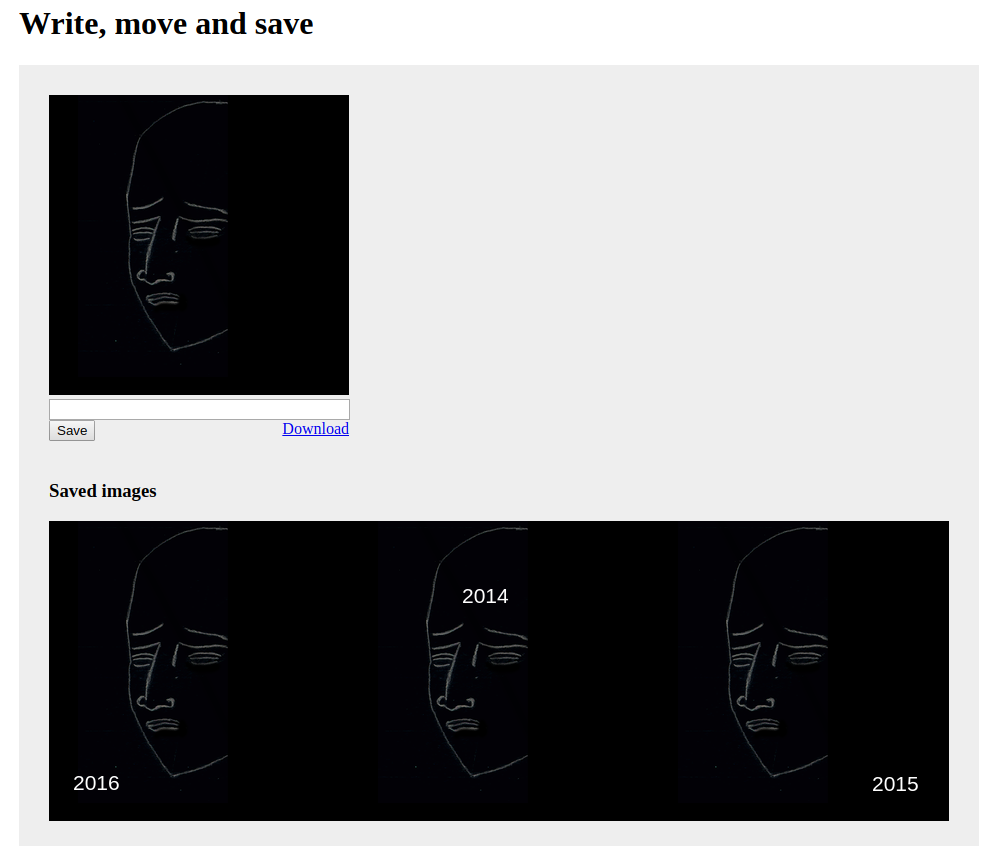

# Wrong canvas

Write a text, move it over the picture and download the result.

If [server-side rendering is enabled](#enable-server-side-rendering), then 
 storing images on the server and listing them, will also be supported.

.

## Setup
[See how to set this up](Setup/README.md).

## Enable server-side rendering
```js
HAS_SERVERSIDE=true
```

## About

This was a part of my homework-test for Web Developer role at Wrong Digital in **April 2013**. 
The task was to provide authorization with Facebook, download the account's profile 
image into this canva, add text, and publish back into the Facebook's wall. 
I did not publish Facebook related parts, because now they are obsolete. 
[I will do it later](TODO.md).

## 2018 Re-animation

Originally, it was implemented as a custom module inside [Dzhim CMS](https://janis-rullis.github.io/dzhim-cms/). 
As I wanted it to be published using Github Pages, then it required to be extracted 
as HTML without the back-end. To keep the server-side solution, I created a switch
 `HAS_SERVERSIDE`, that allowed to enable it, if required.

---------------------
  Created in April 2013  / Re-animated in March 2018
